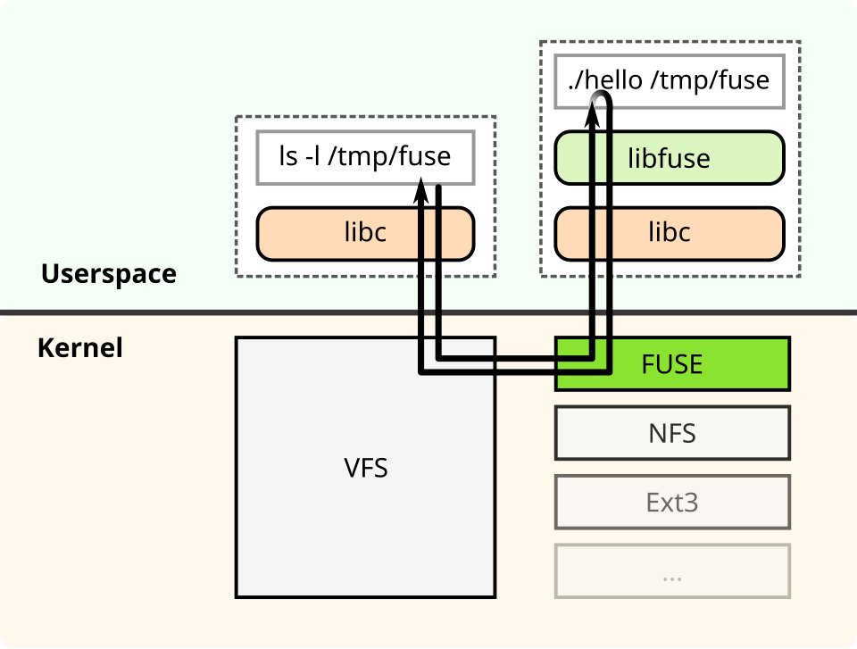
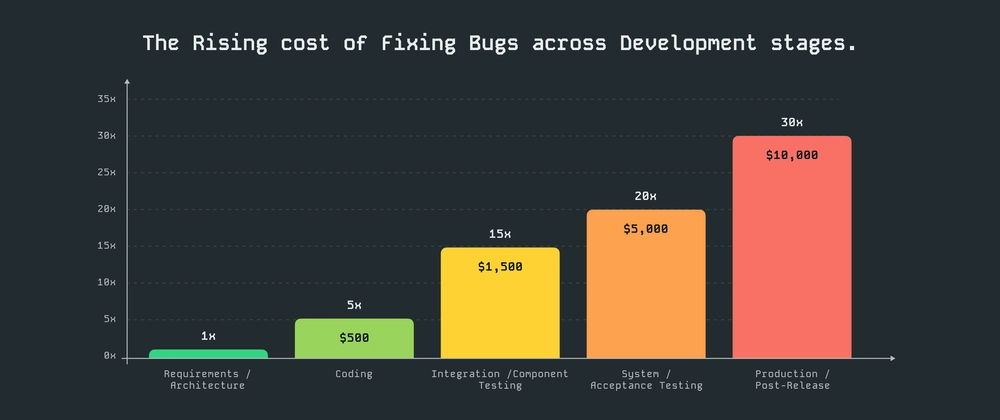
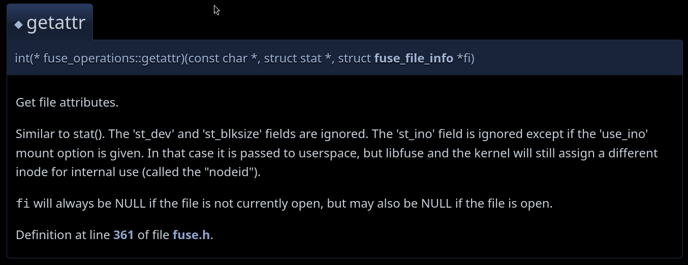
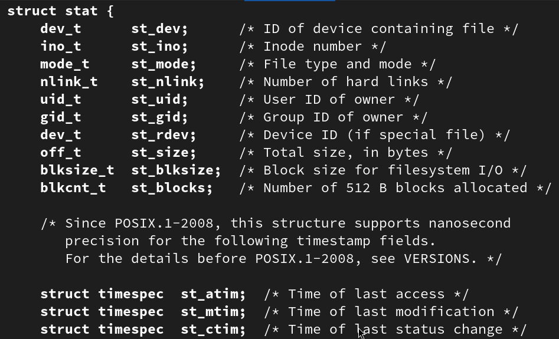
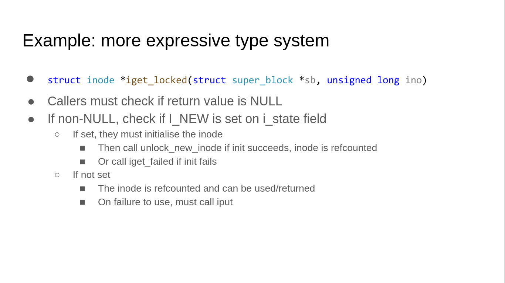

---
theme:
  name: catppuccin-mocha
  override:
    code:
      theme_name: "Monokai Extended Origin"

title: When types prevent bugs
sub_title: Exploring Rust's safety benefits in filesystem development
author: Florian Meißner
---

<!--
    # Outline
    
    - Intro
    - (Basics: Rust)
    - Basics: FUSE/libfuse
    - Motivation: 
      - <show C API>
      - (<show close-to-c Rust bindings>)
      - show my concept
    - Example: hello/hello2
    - Metrics
    - Outlook
    - Questions
    - Sources
      - rust in linux kernel present.
      - cmp with fuser (prob.)
-->


Outline
=======
    
- Basics
- Motivation
- Solution
- Example: hello/hello2
- Comparison
- Outlook
- Sources
- Questions

<!-- end_slide -->


Basics: Rust
============

<!-- column_layout: [3, 2] -->
<!-- column: 0 -->

System-level programming language with emphasis on a strong type system.

> Curry-Howard Correspondence implies that, in a
> sufficiently strict type system, increased
> expressiveness means increased ability to write
> provably correct programs.[^3]

*That means:* With a **strong type system**, we can write programs that are (increasingly) **correct** if they **compile**.

<!-- column: 1 -->

<!-- alignment: center -->
[^1]
<!-- speaker_note: Corro the unsafe Rusturchin (sea urchin == Seeigel) -->
<!-- alignment: left -->

<!-- end_slide -->

Basics: FUSE / libfuse
======================

<!-- column_layout: [5, 4] -->

<!-- column: 1 -->

[^4]
<!-- column: 0 -->

- **F**ilesystem in **USE**rspace
- => no kernel module needed
- Userspace client implements calls like
  `open`, `read`, `write`, `readdir` etc.
  - Similar to libc functions

# Examples
- Container FS': store
folder structure in a single file
- Transparently encrypt files
- Auto-unzip archives
- Restic: mount snapshots

<!-- end_slide -->

Basics: FUSE / libfuse
======================


[^4]

<!-- end_slide -->

Motivation
==========

<!-- pause -->


<!-- alignment: center -->
[^2]
<!-- speaker_note: coding~production -> 15*20*30=900. even coding~testing is 15x -->
<!-- alignment: left -->

<!-- end_slide -->

Motivation
==========



<!-- end_slide -->

Motivation
==========



<!-- end_slide -->

Motivation
==========

```c
// `man sys_stat.h.0p`
struct stat {
    dev_t      st_dev;      /* ID of device containing file */
    ino_t      st_ino;      /* Inode number */
    mode_t     st_mode;     /* File type and mode */
    nlink_t    st_nlink;    /* Number of hard links */
    uid_t      st_uid;      /* User ID of owner */
    gid_t      st_gid;      /* Group ID of owner */
    dev_t      st_rdev;     /* Device ID (if special file) */
    off_t      st_size;     /* Total size, in bytes */
    blksize_t  st_blksize;  /* Block size for filesystem I/O */
    blkcnt_t   st_blocks;   /* Number of 512 B blocks allocated */
// ...
```

<!-- end_slide -->

Motivation
==========

```c
// ...
    struct timespec  st_atim;  /* Time of last access */
    struct timespec  st_mtim;  /* Time of last modification */
    struct timespec  st_ctim;  /* Time of last status change */
}
```

<!-- pause -->
<!-- new_lines: 2 -->

<!-- alignment: center -->

| What                  | Constraints                                             |
| --------------------- | ------------------------------------------------------- |
| `mode_t     st_mode;` | between `0o0000` and `0o7777`; top-most octet           |
|                       | has different meaning depending on file type            |
|                       |                                                         |
| `dev_t      st_dev;`  | can be `S_IFREG` (regular file), `S_IFDIR` (directory), |
|                       | `S_IFLNK ` (symbolic link), etc…                        |

Not to mention more complex relations, e.g. setting `target` for a file that isn't a symbolic link.

<!-- alignment: left -->


<!-- end_slide -->

Motivation
==========

<!-- /*
    // new_lines: 9
*/ -->
```c
// […]
stat stat_;
stat_.st_mode = 0o12345;
stat_.st_dev = 34;

```

<!-- pause -->

<!-- alignment: center -->
<!-- font_size: 5 -->
😥
<!-- font_size: 2 -->
<!-- alignment: left -->

<!-- end_slide -->

Motivation
==========


<!-- alignment: center -->
[^5]
<!-- alignment: left -->

<!-- end_slide -->

Solution
========

<!-- column_layout: [1, 1] -->

<!-- column: 0 -->

```rust
// rust-bindgen-fuse/src/lib.rs
#[derive(Debug, Clone, Copy, PartialEq, Eq)]
#[repr(u32)]
pub enum FileType {
    BlockDevice = libfuse::S_IFBLK,
    CharacterDevice = libfuse::S_IFCHR,
    Fifo = libfuse::S_IFIFO,
    RegularFile = libfuse::S_IFREG,
    Directory = libfuse::S_IFDIR,
    SymbolicLink = libfuse::S_IFLNK,
    Socket = libfuse::S_IFSOCK,
}

#[derive(Debug, Clone, Copy, PartialEq, Eq)]
pub struct FileMode(FileModeRepr);

type FileModeRepr = u32;
```

<!-- pause -->

<!-- column: 1 -->

```rust
#[derive(TypedBuilder)]
#[builder(build_method(into = FileMode))]
pub struct TypedModeBuilder {
    file_type: FileType,

    permissions: FilePermissions,

    #[builder(setter(strip_bool(fallback = toggle_setuid)))]
    setuid: bool,
    #[builder(setter(strip_bool(fallback = toggle_setgid)))]
    setgid: bool,
    #[builder(setter(strip_bool(fallback = toggle_vtx)))]
    vtx_flag: bool,
}
// …
```


<!-- end_slide -->

Solution
========

```rust
let stat = Stat::new_simple(
    TypedModeBuilder::builder()
        .file_type(FileType::RegularFile)
        .permissions(FilePermissions::new(0o444).unwrap())
        .build(),
    1,
    content.len() as i64,
);
```

<!-- pause -->
<!-- new_lines: 1 -->
**It is impossible to construct an illegal value of type ```FileMode```, ```FilePermissions``` or ```Stat```; and in most cases, during compile-time.**

<!-- end_slide -->

<!-- jump_to_middle -->
Example
=======

<!-- end_slide -->

Comparison: `fuser` crate
=======

- https://docs.rs/fuser
- The most popular, up-to-date, crate for Rust FUSE bindings.
- Is very close to raw C-Bindings.

| `fuser`                                                | This project                                |
| ------------------------------------------------------ | ------------------------------------------- |
| Implements the LowLevel FUSE API                       | Implements the "normal" API                 |
| (inode-based, async)                                   | (path-based, sync)                          |
|                                                        |                                             |
| (Usually) vanilla C datatypes without deeper checks,   | More complicated mappings between datatypes |
| probably better performance                            |                                             |
|                                                        |                                             |
| Uses references and other safe Rust datatypes, shields | Additionally, tries to shield against       |
| against memory corruption and unsafe pitfalls          | many logic errors                           |

<!-- end_slide -->

Outlook
=======

<!-- pause -->

# Compile-time bounded integers

<!-- pause -->

```rust
struct FilePermissions(BoundedU16<0, 0o7777>);

let _ = FilePermissions(33_333); // *compiler error*

```
<!-- speaker_note: ideally compile-time, sonst notfalls run-time>
<!-- pause -->

Strategies:
- atleast two Rust crates expose something like this
([bounded-integer](https://docs.rs/bounded-integer/latest/bounded_integer/) and [ranged_integers](https://docs.rs/ranged_integers/latest/ranged_integers/))

<!-- end_slide -->

Outlook
=======

# Conditional builder

<!-- pause -->
```rust
TypedModeBuilder::builder()
    .file_type(FileType::SymbolicLink)
    .target(target_path)
    .permissions(FilePermissions::new(0o444).unwrap())
    .build() // OK

TypedModeBuilder::builder()
    .file_type(FileType::RegularFile)
    .target(target_path)
    .permissions(FilePermissions::new(0o444).unwrap())
            .build() // Compile error: no member `target` on this builder
```

<!-- end_slide -->

Outlook
=======

# Metrics to measure success

- Collect CVEs that happened in recent years, inside filesystems
  - If not enough data, widen to more systems-level code
- Compare which could have been prevented using my approach

<!-- end_slide -->

Sources
=======

[^1]: https://rustacean.net/assets/corro.svg
[^2]: https://dev.to/helloquash/did-you-know-the-cost-of-fixing-bugs-increases-exponentially-the-later-theyre-found-in-the-28pl
[^3]: https://www.ps.uni-saarland.de/courses/sem-ws07/notes/0.pdf, p. 53, 21.01.2025
[^4]: https://en.wikipedia.org/wiki/File:FUSE_structure.svg
[^5]: https://www.youtube.com/watch?v=WiPp9YEBV0Q, "Filesystem in Rust - Kent Overstreet"